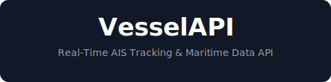

<p align="center">
  <a href="https://vesselapi.com">
    
  </a>
</p>

<h3 align="center">Real-Time AIS Tracking & Maritime Data API</h3>

<p align="center">
  Access global vessel positions, port events, NAVTEX messages, and maritime infrastructure through a simple REST API.
</p>

<p align="center">
  <a href="https://vesselapi.com/docs"><strong>Documentation</strong></a> ·
  <a href="https://vesselapi.com/api-explorer"><strong>API Explorer</strong></a> ·
  <a href="https://dashboard.vesselapi.com"><strong>Dashboard</strong></a> ·
  <a href="https://vesselapi.com/pricing"><strong>Pricing</strong></a> ·
  <a href="mailto:support@vesselapi.com"><strong>Contact</strong></a>
</p>

<p align="center">
  <a href="https://github.com/vesselapi/vesselapi/issues"></a>
  <a href="https://vesselapi.com"></a>
</p>

---

## What is VesselAPI?

VesselAPI provides a unified REST API for accessing real-time maritime data. Instead of integrating multiple data sources and maintaining complex scraping infrastructure, you get a single API endpoint with normalized, reliable data.

**Built for:**
- Maritime research and analytics
- Trade flow analysis
- Fleet monitoring and tracking
- Port operations intelligence
- Supply chain visibility

## Features

| Feature | Description | Availability |
|---------|-------------|--------------|
| **Vessel Positions** | Real-time AIS positions updated continuously | All plans |
| **Vessel Search** | Search by name or callsign | All plans |
| **ETA & Destinations** | Estimated arrival times and reported destinations | All plans |
| **NAVTEX Messages** | Maritime safety broadcasts and weather warnings | All plans |
| **Port Events** | Vessel arrivals and departures at ports worldwide | All plans |
| **Navigation Infrastructure** | DGPS stations, light aids, radio beacons, MODUs | All plans |
| **World Port Index** | Comprehensive database of global ports | All plans |

## Quick Start

### Get Your API Key

1. Sign up at [dashboard.vesselapi.com](https://dashboard.vesselapi.com)
2. Create an API key from your dashboard
3. Start making requests

### Your First Request

**cURL**
```bash
curl -X GET "https://api.vesselapi.com/v1/search/vessels?filter.name=EVERGREEN" \
  -H "Authorization: Bearer YOUR_API_KEY"
```

**Python**
```python
import requests

response = requests.get(
    "https://api.vesselapi.com/v1/search/vessels",
    params={"filter.name": "EVERGREEN"},
    headers={"Authorization": "Bearer YOUR_API_KEY"}
)

vessels = response.json()
for vessel in vessels["data"]:
    print(f"{vessel['name']} - MMSI: {vessel['mmsi']}")
```

**JavaScript**
```javascript
const response = await fetch(
  "https://api.vesselapi.com/v1/search/vessels?filter.name=EVERGREEN",
  {
    headers: { Authorization: "Bearer YOUR_API_KEY" }
  }
);

const { data: vessels } = await response.json();
vessels.forEach(v => console.log(`${v.name} - MMSI: ${v.mmsi}`));
```

## API Endpoints

| Category | Endpoint | Description |
|----------|----------|-------------|
| Vessels | `GET /v1/vessel/{id}` | Get vessel details (requires `filter.idType`) |
| Vessels | `GET /v1/vessel/{id}/position` | Get current AIS position |
| Vessels | `GET /v1/vessel/{id}/eta` | Get ETA and destination |
| Vessels | `GET /v1/vessels/positions` | Get positions for multiple vessels |
| Vessels | `GET /v1/search/vessels` | Search vessels by name or callsign |
| Vessels | `GET /v1/location/vessels/radius` | Find vessels within radius |
| Vessels | `GET /v1/location/vessels/bounding-box` | Find vessels in geographic area |
| Ports | `GET /v1/port/{unlocode}` | Get port details |
| Ports | `GET /v1/search/ports` | Search ports by name |
| Ports | `GET /v1/location/ports/radius` | Find ports within radius |
| Ports | `GET /v1/location/ports/bounding-box` | Find ports in geographic area |
| Port Events | `GET /v1/portevents` | Get port events by time range |
| Port Events | `GET /v1/portevents/port/{unlocode}` | Get events for a specific port |
| Port Events | `GET /v1/portevents/vessel/{id}` | Get port call history for a vessel |
| Port Events | `GET /v1/portevents/vessel/{id}/last` | Get last port event for a vessel |
| NAVTEX | `GET /v1/navtex` | Get NAVTEX maritime safety messages |
| Navigation | `GET /v1/search/lightaids` | Search lighthouses and light aids |
| Navigation | `GET /v1/search/radiobeacons` | Search radio beacons |
| Navigation | `GET /v1/search/dgps` | Search DGPS stations |
| Navigation | `GET /v1/search/modus` | Search offshore drilling units |

All location and navigation endpoints also support bounding-box and radius queries. See [full docs](https://vesselapi.com/docs).

## Pricing

| Plan | Price | Requests/Month |
|------|-------|----------------|
| **Free** | $0/mo | 500 |
| **Starter** | $29/mo | 2,500 |
| **Growth** | $99/mo | 15,000 |
| **Pro** | $249/mo | 50,000 |
| **Unlimited** | $599/mo | Unlimited |

- All paid plans include all endpoints
- **60% off** your first month
- **14-day** money-back guarantee
- No long-term contracts

[View full pricing details](https://vesselapi.com/pricing)

## Documentation

- [Getting Started](https://vesselapi.com/docs)
- [Authentication](https://vesselapi.com/docs#authentication)
- [Rate Limits](https://vesselapi.com/docs#rate-limits)
- [Error Handling](https://vesselapi.com/docs#errors)
- [API Reference](https://vesselapi.com/api-reference)

## Community & Support

### Getting Help

- **Documentation**: [vesselapi.com/docs](https://vesselapi.com/docs)
- **API Reference**: [vesselapi.com/api-reference](https://vesselapi.com/api-reference)
- **Email Support**: support@vesselapi.com (24h response, Mon-Fri)

### Reporting Issues

Found a bug or have a feature request?

- [Report a bug](https://github.com/vesselapi/vesselapi/issues/new?template=bug_report.yml)
- [Request a feature](https://github.com/vesselapi/vesselapi/issues/new?template=feature_request.yml)
- [Report a docs issue](https://github.com/vesselapi/vesselapi/issues/new?template=documentation.yml)

Please search [existing issues](https://github.com/vesselapi/vesselapi/issues) before creating a new one.

## Contributing

We welcome contributions! See [CONTRIBUTING.md](CONTRIBUTING.md) for guidelines on:

- Reporting bugs
- Requesting features
- Improving documentation
- Contributing examples

## Security

Found a security vulnerability? Please report it responsibly via email to security@vesselapi.com. See [SECURITY.md](SECURITY.md) for details.

---

<p align="center">
  <a href="https://vesselapi.com">vesselapi.com</a> ·
  <a href="https://github.com/vesselapi">GitHub</a>
</p>
